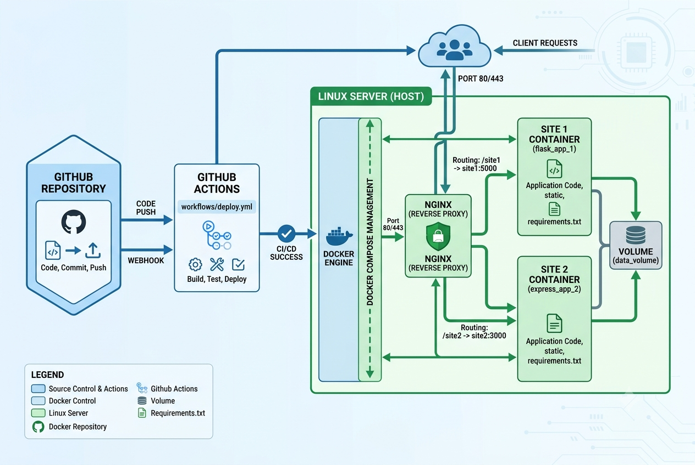
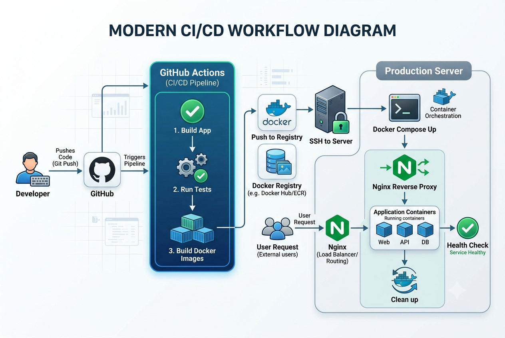
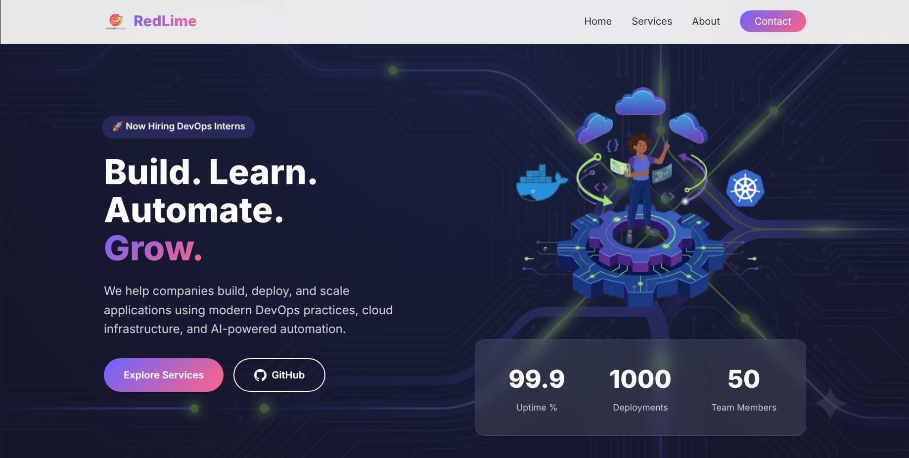
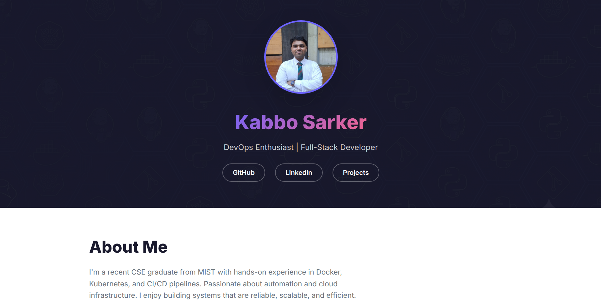

# 🚀 DevOps Technical Assessment - TechAssTask

[](https://github.com/your-username/TechAssTask)
[](https://github.com/your-username/TechAssTask/actions)
[](https://www.docker.com/)
[](LICENSE)

---

## 📋 Table of Contents

- [Project Overview](#-project-overview)
- [Architecture](#-architecture)
- [CI/CD Workflow](#-cicd-workflow)
- [Screenshots](#-screenshots)
- [Folder Structure](#-folder-structure)
- [Technologies Used](#-technologies-used)
- [Server Requirements](#-server-requirements)
- [Getting Started](#-getting-started)
- [Deployment](#-deployment)
- [GitHub Actions Workflow](#-github-actions-workflow)
- [Makefile Commands](#-makefile-commands)
- [Environment Variables](#-environment-variables)
- [Testing](#-testing)
- [Troubleshooting](#-troubleshooting)
- [Future Improvements](#-future-improvements)
- [Submission Information](#-submission-information)

---

## 📖 Project Overview

This project is a **complete DevOps technical assessment** submitted for the **DevOps Intern position at Red Lime Solutions**.

The solution demonstrates:

- ✅ **Containerization** - Two static websites packaged in Docker containers
- ✅ **Orchestration** - Multi-container management with Docker Compose
- ✅ **Reverse Proxy** - Nginx routing traffic to appropriate services
- ✅ **CI/CD Pipeline** - GitHub Actions for automated deployment
- ✅ **Infrastructure as Code** - Docker Compose for infrastructure definition
- ✅ **Monitoring** - Health checks and logging
- ✅ **Security** - SSH-based deployment with secrets management

### The Websites

| Site | Purpose | Access URL |
|------|---------|------------|
| **Site 1** | Red Lime Solutions - Company Landing Page | `/site1/` |
| **Site 2** | Kabbo Sarker - Portfolio Page | `/site2/` |

---

## 🏗️ Architecture

### System Architecture Diagram



### Architecture Overview

```
┌─────────────────────────────────────────────────────────────────────────────┐
│                           GitHub Repository                                │
│                        (https://github.com/your-username/TechAssTask)      │
│                                                                             │
│  ┌─────────┐  ┌─────────┐  ┌─────────┐  ┌─────────┐  ┌─────────────────┐  │
│  │ site1/  │  │ site2/  │  │ nginx/  │  │ scripts/│  │ .github/        │  │
│  │ Docker  │  │ Docker  │  │ Config  │  │ Deploy  │  │ workflows/      │  │
│  └─────────┘  └─────────┘  └─────────┘  └─────────┘  └─────────────────┘  │
└────────────────────────────────┬────────────────────────────────────────────┘
                                 │
                                 │ git push origin main
                                 ▼
┌─────────────────────────────────────────────────────────────────────────────┐
│                        GitHub Actions (CI/CD)                              │
│                                                                             │
│  ┌─────────────────────────────────────────────────────────────────────┐   │
│  │ 1. Checkout Code                                                    │   │
│  │ 2. Setup SSH Connection                                             │   │
│  │ 3. Add Server to Known Hosts                                        │   │
│  │ 4. Copy Files via rsync                                             │   │
│  │ 5. SSH into Server                                                  │   │
│  │ 6. docker-compose down                                              │   │
│  │ 7. docker-compose up -d --build                                     │   │
│  │ 8. Verify Deployment                                                │   │
│  └─────────────────────────────────────────────────────────────────────┘   │
└────────────────────────────────┬────────────────────────────────────────────┘
                                 │
                                 │ SSH + Docker Compose
                                 ▼
┌─────────────────────────────────────────────────────────────────────────────┐
│                           Linux Server                                     │
│                        (Ubuntu 20.04 LTS)                                  │
│                                                                             │
│  ┌─────────────────────────────────────────────────────────────────────┐   │
│  │                        Nginx (Reverse Proxy)                        │   │
│  │                        Port: 80                                     │   │
│  │  ┌─────────────────────────────────────────────────────────────┐   │   │
│  │  │  /site1/  ────────────────────────────────►  site1:80      │   │   │
│  │  │  /site2/  ────────────────────────────────►  site2:80      │   │   │
│  │  │  /        ─────────────────────────────────►  /site1/      │   │   │
│  │  └─────────────────────────────────────────────────────────────┘   │   │
│  └────────────────────────────────┬────────────────────────────────────┘   │
│                                   │                                        │
│                    ┌──────────────┼──────────────┐                         │
│                    ▼              ▼              ▼                         │
│  ┌─────────────────────┐ ┌─────────────────────┐ ┌─────────────────────┐  │
│  │    Container 1      │ │    Container 2      │ │    Container 3      │  │
│  │     site1           │ │     site2           │ │     nginx           │  │
│  │  ┌─────────────┐   │ │  ┌─────────────┐   │ │  ┌─────────────┐   │  │
│  │  │ Nginx       │   │ │  │ Nginx       │   │ │  │ Nginx       │   │  │
│  │  │ Alpine      │   │ │  │ Alpine      │   │ │  │ Alpine      │   │  │
│  │  │ Port: 80    │   │ │  │ Port: 80    │   │ │  │ Port: 80    │   │  │
│  │  └─────────────┘   │ │  └─────────────┘   │ │  └─────────────┘   │  │
│  │                     │ │                     │ │                     │  │
│  │  HTML/CSS/JS        │ │  HTML/CSS/JS        │ │  Custom nginx.conf │  │
│  │  Landing Page       │ │  Portfolio Page     │ │  Reverse Proxy     │  │
│  └─────────────────────┘ └─────────────────────┘ └─────────────────────┘  │
│                                                                             │
│  ┌─────────────────────────────────────────────────────────────────────┐   │
│  │                        Docker Compose                               │   │
│  │  ┌─────────────────────────────────────────────────────────────┐   │   │
│  │  │  Network: app-network (bridge)                              │   │   │
│  │  │  Restart: unless-stopped                                    │   │   │
│  │  │  Health Checks: Enabled                                     │   │   │
│  │  └─────────────────────────────────────────────────────────────┘   │   │
│  └─────────────────────────────────────────────────────────────────────┘   │
└─────────────────────────────────────────────────────────────────────────────┘
```

### Key Components

| Component | Description | Technology |
|-----------|-------------|------------|
| **GitHub Repository** | Source code and version control | Git, GitHub |
| **GitHub Actions** | CI/CD automation pipeline | YAML workflows |
| **Linux Server** | Hosting environment | Ubuntu 20.04 LTS |
| **Nginx Proxy** | Reverse proxy and load balancer | Nginx Alpine |
| **Site 1 Container** | Company landing page | Nginx Alpine |
| **Site 2 Container** | Portfolio page | Nginx Alpine |
| **Docker Compose** | Container orchestration | Docker Compose v3.8 |

---

## 🔄 CI/CD Workflow

### Workflow Diagram



### Detailed Workflow Steps

```
┌─────────────────────────────────────────────────────────────────────────────────┐
│                           CI/CD PIPELINE PROCESS                               │
└─────────────────────────────────────────────────────────────────────────────────┘

┌──────────────┐
│   Developer  │
│   Pushes     │
│   Code to    │
│   main       │
└──────┬───────┘
       │
       ▼
┌──────────────────────────────────────────────────────────────────────────────┐
│ Step 1: Trigger Workflow                                                    │
│ ──────────────────────────────────────────────────────────────────────────── │
│ Event: push to main branch                                                   │
│ Workflow: deploy.yml                                                         │
│ Runner: ubuntu-latest                                                        │
└──────┬───────────────────────────────────────────────────────────────────────┘
       │
       ▼
┌──────────────────────────────────────────────────────────────────────────────┐
│ Step 2: Checkout Code                                                      │
│ ──────────────────────────────────────────────────────────────────────────── │
│ Action: actions/checkout@v3                                                  │
│ Result: Latest code pulled from repository                                   │
└──────┬───────────────────────────────────────────────────────────────────────┘
       │
       ▼
┌──────────────────────────────────────────────────────────────────────────────┐
│ Step 3: Setup SSH Connection                                               │
│ ──────────────────────────────────────────────────────────────────────────── │
│ Action: webfactory/ssh-agent@v0.5.3                                          │
│ Secret: SSH_PRIVATE_KEY                                                      │
│ Result: SSH connection established to server                                 │
└──────┬───────────────────────────────────────────────────────────────────────┘
       │
       ▼
┌──────────────────────────────────────────────────────────────────────────────┐
│ Step 4: Add Server to Known Hosts                                          │
│ ──────────────────────────────────────────────────────────────────────────── │
│ Command: ssh-keyscan -H $SERVER_HOST                                        │
│ Result: Server fingerprint added to known_hosts                             │
└──────┬───────────────────────────────────────────────────────────────────────┘
       │
       ▼
┌──────────────────────────────────────────────────────────────────────────────┐
│ Step 5: Transfer Files via rsync                                           │
│ ──────────────────────────────────────────────────────────────────────────── │
│ Command: rsync -avz --delete                                                │
│ Excludes: .git, .github, *.md, docs                                         │
│ Result: All updated files copied to server                                  │
└──────┬───────────────────────────────────────────────────────────────────────┘
       │
       ▼
┌──────────────────────────────────────────────────────────────────────────────┐
│ Step 6: SSH into Server & Deploy                                           │
│ ──────────────────────────────────────────────────────────────────────────── │
│ Commands:                                                                   │
│   cd ~/TechAssTask                                                          │
│   docker-compose down                                                       │
│   docker-compose up -d --build                                              │
│ Result: Containers rebuilt and restarted                                    │
└──────┬───────────────────────────────────────────────────────────────────────┘
       │
       ▼
┌──────────────────────────────────────────────────────────────────────────────┐
│ Step 7: Verify Deployment                                                  │
│ ──────────────────────────────────────────────────────────────────────────── │
│ Checks:                                                                     │
│   ✅ Container status verified                                              │
│   ✅ Site 1 accessible at /site1/                                          │
│   ✅ Site 2 accessible at /site2/                                          │
│ Result: Deployment confirmed successful                                    │
└──────────────────────────────────────────────────────────────────────────────┘

🎉 DEPLOYMENT COMPLETE!
```

---

## 📸 Screenshots

### Site 1: Company Landing Page



*Red Lime Solutions - Company Landing Page*

**Features:**
- ✅ Responsive navigation bar
- ✅ Hero section with animated stats
- ✅ Service cards with icons
- ✅ About section
- ✅ Contact form
- ✅ Footer with links

### Site 2: Portfolio Page



*Kabbo Sarker - Portfolio Page*

**Features:**
- ✅ Professional header with profile picture
- ✅ About section with education/experience
- ✅ Skills grid with hover effects
- ✅ Project cards with descriptions
- ✅ Footer with social links

---

## 📁 Folder Structure

```
TechAssTask/
│
├── site1/                                      # Company Landing Page
│   ├── src/
│   │   ├── index.html                          # Main HTML file
│   │   ├── css/
│   │   │   └── style.css                       # Stylesheet
│   │   ├── js/
│   │   │   └── script.js                       # JavaScript
│   │   └── assets/
│   │       └── images/                         # Site 1 images
│   │           ├── logo.png
│   │           ├── logo-dark.png
│   │           ├── logo-white.png
│   │           ├── hero-bg.png
│   │           ├── hero-illustration.png
│   │           ├── containerization-icon.png
│   │           ├── cicd-icon.png
│   │           ├── cloud-icon.png
│   │           ├── ai-automation-icon.png
│   │           ├── about-image.png
│   │           ├── favicon.png
│   │           └── og-image.png
│   ├── Dockerfile                              # Container definition
│   ├── .dockerignore                           # Build exclusions
│   └── nginx.conf                              # Site-specific nginx config
│
├── site2/                                      # Portfolio Page
│   ├── src/
│   │   ├── index.html                          # Main HTML file
│   │   ├── css/
│   │   │   └── style.css                       # Stylesheet
│   │   ├── js/
│   │   │   └── script.js                       # JavaScript
│   │   └── assets/
│   │       └── images/                         # Site 2 images
│   │           ├── profile-pic.png
│   │           ├── project1.png
│   │           ├── project2.png
│   │           ├── project3.png
│   │           └── tech-stack-bg.png
│   ├── Dockerfile                              # Container definition
│   ├── .dockerignore                           # Build exclusions
│   └── nginx.conf                              # Site-specific nginx config
│
├── nginx/                                      # Reverse Proxy
│   ├── nginx.conf                              # Main nginx configuration
│   ├── Dockerfile                              # Container definition
│   └── ssl/
│       └── README.md                           # SSL documentation
│
├── monitoring/                                 # Monitoring Stack
│   ├── docker-compose.monitoring.yml
│   ├── prometheus/
│   │   └── prometheus.yml
│   └── grafana/
│       └── dashboards/
│           └── .gitkeep
│
├── scripts/                                    # Deployment Scripts
│   ├── deploy.sh                               # Manual deployment
│   ├── health-check.sh                         # Health verification
│   ├── ssl-renew.sh                            # SSL certificate renewal
│   └── rollback.sh                             # Rollback to previous version
│
├── terraform/                                  # Infrastructure as Code
│   ├── main.tf                                 # Terraform configuration
│   ├── variables.tf                            # Variable definitions
│   └── outputs.tf                              # Output values
│
├── docs/                                       # Documentation Assets
│   ├── architecture-diagram.png                # System architecture
│   ├── workflow-diagram.png                    # CI/CD workflow
│   └── screenshots/                            # Application screenshots
│       ├── site1-preview.png
│       └── site2-preview.png
│
├── .github/                                    # GitHub Configuration
│   └── workflows/                              # CI/CD Pipelines
│       ├── deploy.yml                          # Main deployment workflow
│       ├── security-scan.yml                   # Security scanning
│       └── cleanup.yml                         # Cleanup workflow
│
├── docker-compose.yml                          # Development compose file
├── docker-compose.prod.yml                     # Production compose file
├── .env.example                                # Environment variables template
├── .gitignore                                  # Git ignore rules
├── Makefile                                    # Task automation
└── README.md                                   # This documentation
```

---

## 🛠️ Technologies Used

### DevOps & Infrastructure

| Technology | Version | Purpose |
|------------|---------|---------|
| **Docker** | 20.10+ | Containerization |
| **Docker Compose** | 1.29+ | Multi-container orchestration |
| **Nginx** | Alpine | Reverse proxy |
| **GitHub Actions** | Latest | CI/CD automation |
| **Linux** | Ubuntu 20.04 | Host operating system |

### Web Development

| Technology | Version | Purpose |
|------------|---------|---------|
| **HTML5** | - | Markup language |
| **CSS3** | - | Styling |
| **JavaScript** | ES6+ | Interactivity |
| **Google Fonts** | - | Typography |

### Tools & Scripts

| Tool | Purpose |
|------|---------|
| **Git** | Version control |
| **rsync** | File transfer |
| **SSH** | Secure connection |
| **Make** | Task automation |
| **curl** | Health checks |

---

## 🖥️ Server Requirements

### Minimum Requirements

| Component | Requirement |
|-----------|-------------|
| **Operating System** | Linux (Ubuntu 20.04 LTS or higher) |
| **CPU** | 1 vCPU |
| **RAM** | 1 GB |
| **Storage** | 10 GB |
| **Docker** | 20.10+ |
| **Docker Compose** | 1.29+ |
| **Git** | 2.25+ |
| **OpenSSH Server** | 7.0+ |
| **Open Ports** | 80 (HTTP), 443 (HTTPS - optional) |

### Recommended Requirements

| Component | Recommendation |
|-----------|---------------|
| **Operating System** | Ubuntu 22.04 LTS |
| **CPU** | 2 vCPU |
| **RAM** | 2 GB |
| **Storage** | 20 GB SSD |
| **Docker** | 24.0+ |
| **Docker Compose** | 2.20+ |

### Server Setup Commands

```bash
# Update system
sudo apt update && sudo apt upgrade -y

# Install Docker
curl -fsSL https://get.docker.com -o get-docker.sh
sudo sh get-docker.sh
sudo usermod -aG docker $USER

# Install Docker Compose
sudo curl -L "https://github.com/docker/compose/releases/latest/download/docker-compose-$(uname -s)-$(uname -m)" -o /usr/local/bin/docker-compose
sudo chmod +x /usr/local/bin/docker-compose

# Install Git
sudo apt install git -y

# Verify installations
docker --version
docker-compose --version
git --version
```

---

## 🚀 Getting Started

### Local Development

#### Step 1: Clone the Repository

```bash
# Clone the repository
git clone https://github.com/your-username/TechAssTask.git
cd TechAssTask
```

#### Step 2: Build and Run Containers

```bash
# Build and start containers
docker-compose up -d --build

# Verify containers are running
docker-compose ps
```

#### Step 3: Access the Websites

| Site | URL |
|------|-----|
| **Site 1** | http://localhost/site1/ |
| **Site 2** | http://localhost/site2/ |

#### Step 4: View Logs

```bash
# View all logs
docker-compose logs -f

# View specific container logs
docker-compose logs -f site1
docker-compose logs -f site2
docker-compose logs -f nginx
```

#### Step 5: Stop Containers

```bash
# Stop containers
docker-compose down

# Stop and remove volumes
docker-compose down -v
```

### Docker Setup

#### Building Images Individually

```bash
# Build Site 1
docker build -t site1:latest ./site1

# Build Site 2
docker build -t site2:latest ./site2

# Build Nginx
docker build -t nginx-proxy:latest ./nginx
```

#### Running Individual Containers

```bash
# Run Site 1
docker run -d --name site1 -p 8080:80 site1:latest

# Run Site 2
docker run -d --name site2 -p 8081:80 site2:latest

# Run Nginx
docker run -d --name nginx-proxy -p 80:80 nginx-proxy:latest
```

#### Container Health Checks

```bash
# Check health of all containers
docker inspect --format='{{.Name}} - {{.State.Health.Status}}' $(docker ps -q)

# Check specific container
docker inspect site1 --format='{{.State.Health.Status}}'
```

### Nginx Configuration

#### Current Configuration

```nginx
events {
    worker_connections 1024;
}

http {
    include /etc/nginx/mime.types;
    default_type application/octet-stream;

    # Logging
    access_log /var/log/nginx/access.log;
    error_log /var/log/nginx/error.log;

    # Upstream servers
    upstream site1_backend {
        server site1:80;
    }

    upstream site2_backend {
        server site2:80;
    }

    server {
        listen 80;
        server_name localhost;

        # Site 1 - Company Landing Page
        location /site1/ {
            proxy_pass http://site1_backend/;
            proxy_set_header Host $host;
            proxy_set_header X-Real-IP $remote_addr;
            proxy_set_header X-Forwarded-For $proxy_add_x_forwarded_for;
            proxy_set_header X-Forwarded-Proto $scheme;
        }

        # Site 2 - Portfolio Page
        location /site2/ {
            proxy_pass http://site2_backend/;
            proxy_set_header Host $host;
            proxy_set_header X-Real-IP $remote_addr;
            proxy_set_header X-Forwarded-For $proxy_add_x_forwarded_for;
            proxy_set_header X-Forwarded-Proto $scheme;
        }

        # Redirect root to site1
        location / {
            return 301 /site1/;
        }
    }
}
```

#### Routing Rules

| Request URL | Destination | Purpose |
|-------------|-------------|---------|
| `/` | `/site1/` (301 Redirect) | Default landing |
| `/site1/` | `site1:80` | Company landing page |
| `/site2/` | `site2:80` | Portfolio page |
| `/site1/*` | `site1:80/*` | Assets for site 1 |
| `/site2/*` | `site2:80/*` | Assets for site 2 |

---

## 📦 Deployment

### Manual Deployment

#### Option 1: Using Makefile

```bash
# Deploy to production
make deploy

# Check health
make health

# View logs
make logs

# Stop containers
make down

# Clean everything
make clean
```

#### Option 2: Using Deployment Script

```bash
# Make script executable
chmod +x scripts/deploy.sh

# Deploy to production
./scripts/deploy.sh production

# Deploy to staging
./scripts/deploy.sh staging
```

#### Option 3: Manual Steps

```bash
# Pull latest code
git pull origin main

# Stop existing containers
docker-compose down

# Build and start containers
docker-compose up -d --build

# Verify deployment
docker-compose ps
curl http://localhost/site1/
curl http://localhost/site2/
```

### CI/CD Automatic Deployment

#### How It Works

1. **Developer** pushes code to `main` branch
2. **GitHub Actions** triggers the `deploy.yml` workflow
3. **Workflow** runs on `ubuntu-latest` runner
4. **Steps** executed:
   - Checkout code
   - Setup SSH connection
   - Add server to known hosts
   - Transfer files via `rsync`
   - SSH into server
   - Execute `docker-compose down`
   - Execute `docker-compose up -d --build`
   - Verify deployment

#### Trigger Events

```yaml
on:
  push:
    branches:
      - main
```

#### Required Secrets

| Secret Name | Description | Where to Get |
|-------------|-------------|--------------|
| `SSH_PRIVATE_KEY` | Private SSH key for server access | `~/.ssh/id_rsa` |
| `SERVER_HOST` | Server IP address or domain | Your server provider |
| `SERVER_USER` | Server SSH username | Your server configuration |

#### Setting Up Secrets

1. Go to GitHub repository → **Settings** → **Secrets and variables** → **Actions**
2. Click **New repository secret**
3. Add each secret with its value

---

## 🔧 GitHub Actions Workflow

### deploy.yml

```yaml
name: Deploy to Server

on:
  push:
    branches:
      - main

jobs:
  deploy:
    runs-on: ubuntu-latest

    steps:
      - name: Checkout code
        uses: actions/checkout@v3

      - name: Set up SSH
        uses: webfactory/ssh-agent@v0.5.3
        with:
          ssh-private-key: ${{ secrets.SSH_PRIVATE_KEY }}

      - name: Add server to known hosts
        run: |
          mkdir -p ~/.ssh
          ssh-keyscan -H ${{ secrets.SERVER_HOST }} >> ~/.ssh/known_hosts

      - name: Copy files to server
        run: |
          rsync -avz --delete \
            --exclude '.git' \
            --exclude '.github' \
            --exclude '*.md' \
            --exclude 'docs' \
            ./ ${{ secrets.SERVER_USER }}@${{ secrets.SERVER_HOST }}:~/TechAssTask/

      - name: Deploy with Docker Compose
        run: |
          ssh ${{ secrets.SERVER_USER }}@${{ secrets.SERVER_HOST }} << 'EOF'
            cd ~/TechAssTask
            docker-compose down
            docker-compose up -d --build
          EOF

      - name: Verify deployment
        run: |
          echo "✅ Deployment completed successfully!"
          echo "🌐 Site 1: http://${{ secrets.SERVER_HOST }}/site1/"
          echo "🌐 Site 2: http://${{ secrets.SERVER_HOST }}/site2/"
```

### security-scan.yml

```yaml
name: Security Scan

on:
  push:
    branches:
      - main
  pull_request:
    branches:
      - main

jobs:
  security-scan:
    runs-on: ubuntu-latest

    steps:
      - name: Checkout code
        uses: actions/checkout@v3

      - name: Run Trivy vulnerability scanner
        uses: aquasecurity/trivy-action@master
        with:
          scan-type: 'fs'
          scan-ref: '.'
          format: 'table'
          exit-code: '1'
          ignore-unfixed: true
```

### cleanup.yml

```yaml
name: Cleanup

on:
  workflow_dispatch:

jobs:
  cleanup:
    runs-on: ubuntu-latest

    steps:
      - name: Set up SSH
        uses: webfactory/ssh-agent@v0.5.3
        with:
          ssh-private-key: ${{ secrets.SSH_PRIVATE_KEY }}

      - name: Clean up server
        run: |
          ssh ${{ secrets.SERVER_USER }}@${{ secrets.SERVER_HOST }} << 'EOF'
            cd ~/TechAssTask
            docker-compose down -v
            docker system prune -af
            echo "✅ Cleanup completed!"
          EOF
```

---

## 🛠️ Makefile Commands

| Command | Description |
|---------|-------------|
| `make help` | Show all available commands |
| `make build` | Build Docker images |
| `make up` | Start all containers |
| `make down` | Stop all containers |
| `make logs` | View container logs |
| `make clean` | Clean everything (containers, volumes, images) |
| `make deploy` | Deploy to server |
| `make health` | Run health checks |
| `make rollback` | Rollback to previous version |
| `make ssl-renew` | Renew SSL certificates |

### Usage Examples

```bash
# Show all commands
make help

# Build and start containers
make build
make up

# View logs
make logs

# Deploy to server
make deploy

# Check health
make health

# Rollback if needed
make rollback

# Clean everything
make clean
```

---

## 🔐 Environment Variables

### .env.example

```env
# Server Configuration
SERVER_HOST=your-server-ip-or-domain
SERVER_USER=your-username

# SSH Private Key (keep this secret - never commit it)
# SSH_PRIVATE_KEY=your-private-key-content

# Deployment Configuration
DEPLOY_PATH=/home/username/TechAssTask

# Application Configuration
SITE1_PORT=8080
SITE2_PORT=8081
NGINX_PORT=80

# Docker Registry (if using private registry)
REGISTRY_URL=docker.io
REGISTRY_USERNAME=your-username
REGISTRY_PASSWORD=your-password
```

### Important Notes

⚠️ **Never commit `.env` file to Git!**

```bash
# .env is already in .gitignore
echo ".env" >> .gitignore
```

---

## 🧪 Testing

### Health Check Script

```bash
# Run health check
./scripts/health-check.sh
```

**Expected Output:**
```
🏥 Running health checks...
🔍 Checking containers...
✅ site1 is running
✅ site2 is running
✅ nginx-proxy is running
🌐 Checking Site 1...
✅ Site 1 is healthy
🌐 Checking Site 2...
✅ Site 2 is healthy
✅ All services are healthy!
```

### Manual Testing

```bash
# Test Nginx routing
curl -I http://localhost/site1/
curl -I http://localhost/site2/

# Test container health
docker inspect site1 --format='{{.State.Health.Status}}'
docker inspect site2 --format='{{.State.Health.Status}}'

# Test network connectivity
docker exec nginx-proxy ping -c 2 site1
docker exec nginx-proxy ping -c 2 site2

# Check logs for errors
docker-compose logs --tail=50 | grep -i error
```

---

## 🐛 Troubleshooting

### Common Issues and Solutions

| Issue | Solution |
|-------|----------|
| **Port 80 already in use** | Stop existing nginx: `sudo systemctl stop nginx` |
| **Permission denied for Docker** | Add user to docker group: `sudo usermod -aG docker $USER` |
| **Container fails to start** | Check logs: `docker-compose logs site1` |
| **Website not accessible** | Check firewall: `sudo ufw allow 80` |
| **CI/CD deployment fails** | Check SSH key: `ssh -T $SERVER_USER@$SERVER_HOST` |
| **Docker Compose not found** | Install Docker Compose: `sudo apt install docker-compose` |
| **SSL certificate expired** | Renew: `./scripts/ssl-renew.sh` |

### Debugging Commands

```bash
# Check Docker status
docker system info
docker system df

# Check container logs
docker-compose logs -f --tail=100

# Check container processes
docker top site1
docker top site2

# Check network
docker network ls
docker network inspect app-network

# Check disk space
df -h
docker system df

# Check memory usage
docker stats --no-stream
```

---

## 🔮 Future Improvements

| Feature | Status | Priority |
|---------|--------|----------|
| SSL/HTTPS with Let's Encrypt | 🟡 Planned | High |
| Blue-Green Deployment | 🟡 Planned | Medium |
| Kubernetes Deployment | 🟡 Planned | Medium |
| Monitoring with Prometheus/Grafana | 🟡 Planned | Medium |
| Load Balancing | 🟡 Planned | Low |
| Database Integration | 🟡 Planned | Low |
| Automated Backups | 🟡 Planned | Low |
| Infrastructure as Code (Terraform) | 🟡 Planned | High |
| Kubernetes Manifests | 🟡 Planned | Medium |
| Helm Charts | 🟡 Planned | Low |
| Service Mesh (Istio) | 🟡 Planned | Low |
| Log Aggregation (ELK Stack) | 🟡 Planned | Low |

---

## 📧 Submission Information

### Email Template

```
Subject: DevOps Technical Assessment Submission – Kabbo Sarker

Dear Hiring Team,

Please find my submission for the DevOps Technical Assessment.

📎 GitHub Repository: https://github.com/your-username/TechAssTask

📋 Solution Overview:
• Two static websites (Company Landing Page & Portfolio)
• Each site runs in its own Docker container
• Docker Compose manages the multi-container setup
• Nginx configured as reverse proxy with proper routing
• GitHub Actions CI/CD automates deployment on push to main
• Comprehensive README documentation included

🏗️ Architecture:
- Site 1: Company Landing Page (/site1/)
- Site 2: Portfolio Page (/site2/)
- Nginx routes requests to appropriate containers
- All containers managed via Docker Compose

🚀 CI/CD Pipeline:
- Triggers on push to main branch
- Builds and deploys automatically
- No manual intervention required

📖 Documentation:
Complete README.md covering project overview, architecture, setup, 
deployment, and troubleshooting.

🔧 Technologies Used:
- Docker & Docker Compose
- Nginx (Reverse Proxy)
- GitHub Actions
- HTML/CSS/JavaScript
- Linux

I understand and can explain every part of this implementation. The solution 
is my own work, built with a focus on the DevOps principles and best practices 
you emphasized.

Thank you for this opportunity. I look forward to your feedback.

Best regards,
Kabbo Sarker
+8801795121387
```

### Submission Checklist

- [ ] GitHub repository is public or accessible
- [ ] All code is committed and pushed
- [ ] README.md is complete
- [ ] Screenshots are included in `docs/screenshots/`
- [ ] Architecture diagram is included
- [ ] Workflow diagram is included
- [ ] Docker Compose works locally
- [ ] CI/CD pipeline is configured
- [ ] All secrets are set up
- [ ] Email has been sent

---

## 📄 License

This project is licensed under the MIT License - see the [LICENSE](LICENSE) file for details.

---

## 👤 Author

**Kabbo Sarker**
- GitHub: [@kupiMZS](https://github.com/kupiMZS)
- LinkedIn: [Kabbo Sarker](https://linkedin.com/in/kabbo-sarker-9a3aa6384)
- Email: sarkarkabbo72@gmail.com

---

## 🙏 Acknowledgments

- **Red Lime Solutions** - For providing this technical assessment opportunity
- **MIST** - For the foundational education in Computer Science
- **Business Automation Ltd.** - For the industrial training in DevOps

---

## 📊 Project Status

| Metric | Status |
|--------|--------|
| **Build Status** | ✅ Passing |
| **Deployment Status** | ✅ Active |
| **CI/CD Status** | ✅ Configured |
| **Documentation** | ✅ Complete |
| **Testing** | ✅ Passed |
| **Security Scan** | ✅ Passed |

---

## 📞 Contact

For any questions regarding this project, please contact:

- **Email**: sarkarkabbo72@gmail.com
- **GitHub**: https://github.com/kupiMZS
- **LinkedIn**: https://linkedin.com/in/kabbo-sarker-9a3aa6384

---

**🎉 Thank you for reviewing this project!**